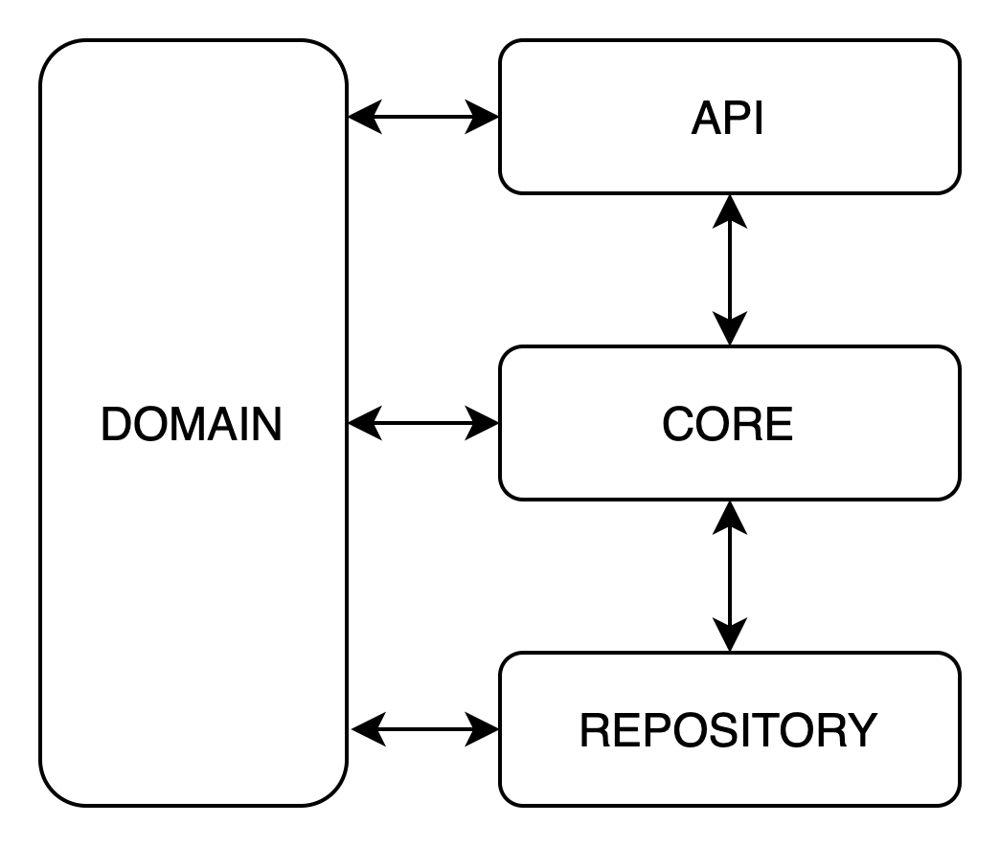

# credit-line-authorizer
tribal coding challenge

```shell
./mvnw package
docker-compose up --build
```

```
curl --location --request POST 'http://localhost:8080/credit-line/request' \
--header 'Content-Type: application/json' \
--data-raw '{
    "taxId":"4",
    "foundingType": "SME",
    "cashBalance": 7000,
    "monthlyRevenue": 10001,
    "requestedCreditLine": 6000,
    "requestedDate": "2021-07-19T16:32:59.860Z"
}'
```

Code

* Domain: General structure, shared model, converters, exception handlres 
* Api: Entrypoint  
* Core: Business Rules
* Repository: Data Access layer

Daniel Díaz Cortés
daniel.diazco@gmail.com